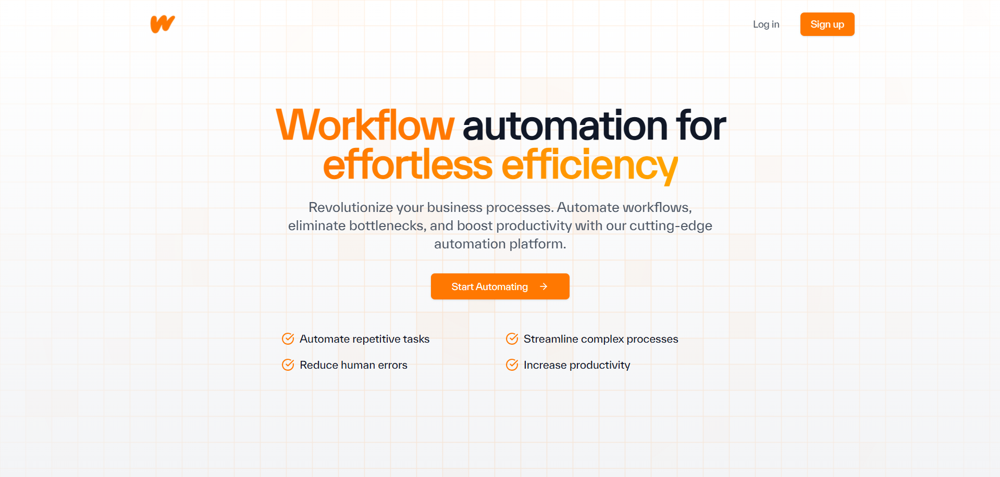
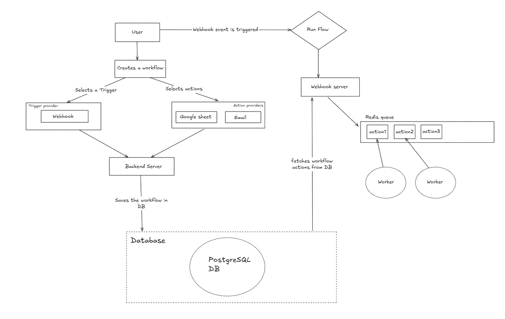
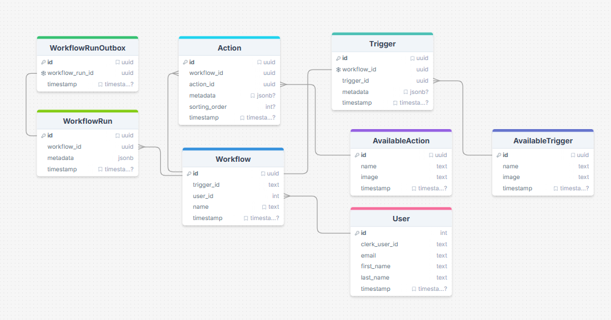

# [Workflow Automation](https://workflows-flax.vercel.app)



> Automate your Workflows with ease

## Solution

Workflow Automation enables seamless automation of your workflows. Users can effortlessly create workflows and configure them to the available trigger providers and multiple available actions with precision or use pre-built AI-powered templates. Designed with a robust event-driven architecture, the application ensures reliable and asynchronous execution of actions upon each trigger, providing high performance.

## Demo Video

[Watch Workflow Automation Demo 🚀](https://www.loom.com/share/45ca04286a0e4497b78689a3fbe48b3f?sid=5e3795c0-6343-4087-86af-b4b46e82b206)

## Features

- Streamlined Workflow Creation
- Webhook trigger provider
- Automate your Google Sheet
- Mailing service for instant mails
- AI-powered workflow templates
- Clean and MVC OOPs architecture
- Secure Clerk Authentication and Authorization
- Beautiful User Interface
- React Flow for User-Friendly Experience
- Webhook secret key to authenticate and secure the Webhook endpoint


## System Architecture




## DB Diagram



## Tech Stack

### Backend
- **PostgerSQL** - SQL database for storing data and maintain complex data relations
- **Prisma** - Efficient ORM for database interactions
- **Redis** - In-memory database and queue management
- **Node.js** - JavaScript runtime for server-side development
- **Express** - Web framework for Node.js
- **Nodemailer** - For sending emails
- **Gemini** - To analyze the scraped content and generate detailed description
- **Zod** - Used for validation

### Frontend
- **Next.js** - React framework for production
- **TypeScript** - Superset of JavaScript for type safety
- **Tailwind CSS** - Utility-first CSS framework
- **React Flow** - React library to built user friendly workflows

## Deployment
- **Vercel** - Deployment platform for frontend
- **Render** - Deployment platform for backend services

## Deployment Links

- Frontend: [Workflow Automation](https://workflows-flax.vercel.app)
- Backend: [Backend Server](https://automate-workflow-backend.onrender.com)
- Webhook: [Webhook Server](https://workflow-hooks.onrender.com)
- Worker: [Worker Server](https://workflow-worker-o8lo.onrender.com)

## Solution Future Aspects

- Add more Trigger and Action provider to expand the Workflow Automation
- Provide user to connect with the provider to reduce manual workload
- Add notification channels (Slack, Discord)

## Pros and Cons of Proposed Solution

### Pros
- Streamlined and user-friendly interface
- Event-driven asynchronous processing
- Clean and MVC OOPs architecture
- Dedicated Webhook Server for scalable event handling
- Secured Webhook endpoint using unique secret key
- AI-powered pre-built templates

### Cons
- Transition to microservices architecture

## Getting Started

### Installation

1. Clone the repository:

    ```
    git clone https://github.com/Shreekar11/Automate-Workflow.git
    ```

2. Navigate to the project directory:

    ```
    cd Automate-Workflow
    ```

### Running Frontend

1. Navigate to the project directory:

    ```
    cd frontend
    ```


2. Install dependencies:

    ```
    npm install
    ```

3. Create a `.env` file in the root directory and add your environment variables:

    ```
    NEXT_PUBLIC_CLERK_PUBLISHABLE_KEY=
    CLERK_SECRET_KEY=
    NEXT_PUBLIC_CLERK_SIGN_IN_URL=
    NEXT_PUBLIC_CLERK_SIGN_UP_URL=
    NEXT_PUBLIC_CLERK_AFTER_SIGN_IN_URL=
    NEXT_PUBLIC_CLERK_AFTER_SIGN_UP_URL=
    WEBHOOK_SECRET=
    NEXT_PUBLIC_BASE_URL=
    NEXT_PUBLIC_WEBHOOK_URL=
    ```

4. Run the frontend:

    ```
    npm run dev
    ```

5. Open [http://localhost:3000](http://localhost:3000) in your browser to see the application.

### Running Backend Server

1. Create a `.env` file in the root directory and add your environment variables:

    ```
    DATABASE_URL=
    CLERK_PUBLISHABLE_KEY=
    CLERK_SECRET_KEY=
    BACKEND_URL=
    FRONTEND_URL=
    ```

2. Navigate to the backend directory and start the server:

    ```
    cd backend
    npm install
    npm run dev
    ```

3. Server will run on endpoint :- [http://localhost:8080](http://localhost:8080) 

### Running Webhook Server

1. Create a `.env` file in the root directory and add your environment variables:

    ```
    DATABASE_URL=
    WEBHOOK_URL=
    REDIS_URL=
    FRONTEND_URL=
    ```

2. Install Redis using Docker, run the below Docker command to pull the redis docker image: 

    ```
    docker run -d --name redis-queue -p 6379:6379 -p 8001:8001 redis/redis-stack:latest
    ```

3. Navigate to the hooks directory and start the server:

    ```
    cd hooks
    npm install
    npm run dev
    ```

4. Webhook Server will run on endpoint :- [http://localhost:5000](http://localhost:5000) 

### Running Worker Server

1. Create a `.env` file in the root directory and add your environment variables:

    ```
    DATABASE_URL=
    MAIL_USERNAME=
    MAIL_PASSWORD=
    GOOGLE_CLIENT_EMAIL=
    GOOGLE_PRIVATE_KEY=
    WORKER_URL=
    REDIS_URL=
    ```

2. Navigate to the worker directory and start the server:

    ```
    cd worker
    npm install
    npm run dev
    ```
3. Worker Server will run on endpoint :- [http://localhost:8000](http://localhost:8000) 

## Run the project via **Docker**

## Prerequisites

- Docker

## For Linux System:

To install Docker, run the following commands in your terminal:

    ```
    curl -fsSL https://get.docker.com -o get-docker.sh
    sudo sh get-docker.sh
    ```

## Development Environment For Server

- Navigate into **backend** directory
- Add the `.env` file in the directory. The env file being used for development is called `.env`
- To get started with development first build the dev containers using the following command

    ```bash
    docker-compose build
    ```

- Run the containers using the command

    ```bash
    docker-compose -up
    ```

## Development Environment For Client

- Navigate into **frontend** directory
- Add the `.env` file in the directory. The env file being used for development is called `.env`
- To get started with development first build the dev containers using the following command

    ```bash
    docker-compose build
    ```

- Run the containers using the command

    ```bash
    docker-compose -up
    ```

## Development Environment For Webhook Server

- Navigate into **hooks** directory
- Add the `.env` file in the directory. The env file being used for development is called `.env`
- To get started with development first build the dev containers using the following command

    ```bash
    docker-compose build
    ```

- Run the containers using the command

    ```bash
    docker-compose -up
    ```

## Development Environment For Worker Server

- Navigate into **worker** directory
- Add the `.env` file in the directory. The env file being used for development is called `.env`
- To get started with development first build the dev containers using the following command

    ```bash
    docker-compose build
    ```

- Run the containers using the command

    ```bash
    docker-compose -up
    ```

## Contact

For any inquiries or support, please email us at shreekargade2004@gmail.com or open an issue in this repository.

Enjoy your workflow automation process!⚒️🚀
